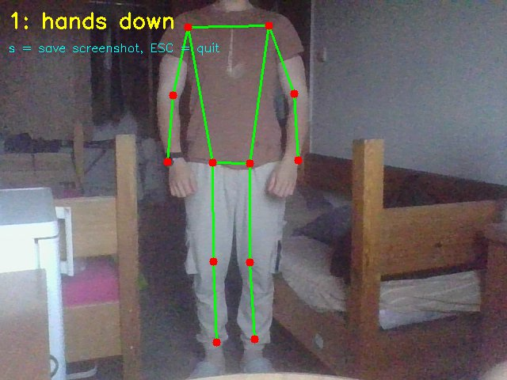
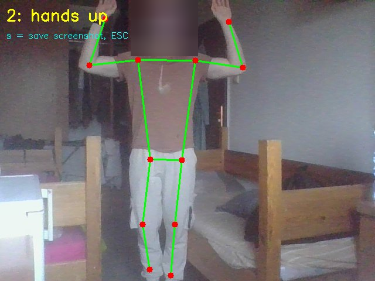
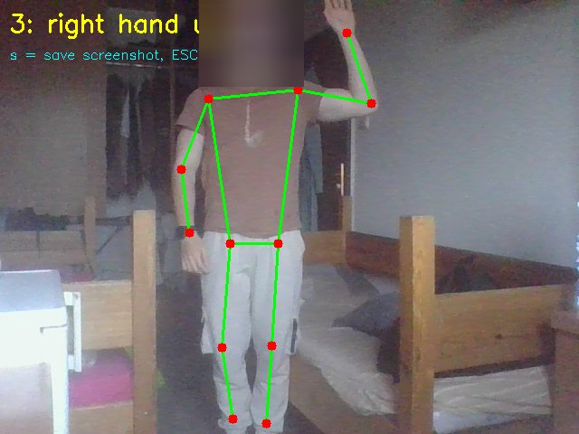
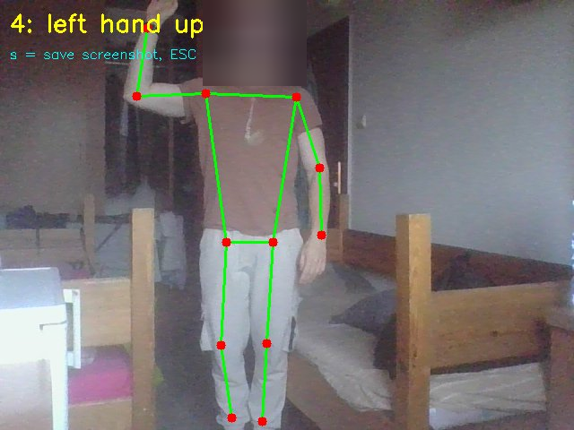
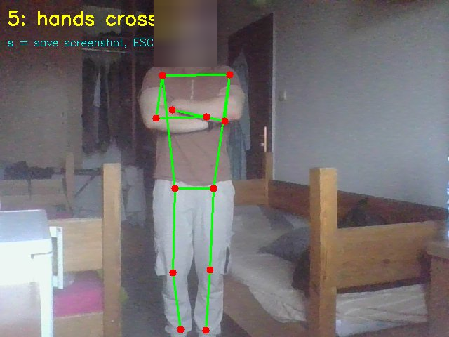
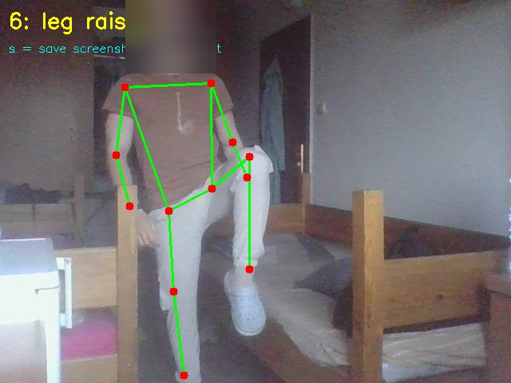

# Pose Estimation Gesture Recognition

This project recognises body gestures from a live webcam stream using the k-nearest neighbours (k-NN) method. It is a Python re-implementation of a MATLAB pose-estimation example used in an Image Processing course, built with MediaPipe Pose Landmarker and OpenCV.

## Overview

Body keypoints (shoulders, elbows, wrists, hips, knees, ankles) are extracted from each webcam frame and normalised so the result does not depend on body size or distance from the camera. A gesture is recognised by comparing the current pose against a set of saved reference poses and taking a majority vote among the nearest neighbours — the same k-NN idea used in the original geometric-figures classification example.

No deep learning model is trained in this project; MediaPipe only provides the keypoint detection, while the classification itself is plain k-NN.

## Gestures

| # | Gesture | Type |
|---|---------|------|
| 1 | Hands down | base |
| 2 | Hands up | base |
| 3 | Right hand up | base |
| 4 | Left hand up | base |
| 5 | Hands crossed | new hand gesture |
| 6 | Leg raised | new leg gesture |

## Requirements

- Python 3.x
- Libraries:
  ```bash
  pip install mediapipe opencv-python numpy
  ```
- Model file (not included in this repository, see [.gitignore](.gitignore)):
  [`pose_landmarker_lite.task`](https://storage.googleapis.com/mediapipe-models/pose_landmarker/pose_landmarker_lite/float16/latest/pose_landmarker_lite.task) — place it in the same folder as `gesture.py`.

## How to run

**1. Teaching mode** — record reference poses for your own body:

```bash
python gesture.py teach
```

- Stand back so the whole body (head to ankles) is visible.
- Hold a pose and press a number key (1–6) to save it.
- Record about 3 samples per gesture.
- Press `s` to save them to `templates.json`, `ESC` to quit.

**2. Recognition mode** — classify gestures live:

```bash
python gesture.py run
```

- The recognised gesture is shown in the top-left corner.
- Press `s` to save a screenshot, `ESC` to quit.

> `templates.json` is not included in this repository, since it is generated from the user's own body measurements during teaching mode. Run the teaching step first to create your own file.

## Results

All six gestures were recognised correctly and consistently during testing. Screenshots below were captured in recognition mode (faces blurred for privacy):

| | |
|---|---|
|  |  |
|  |  |
|  |  |

## Files

| File | Description |
|------|--------------|
| `gesture.py` | Main program (teaching + recognition) |
| `pose.py` | Simple skeleton test script used during setup |
| `shot_*_*.png` | Example screenshots of the six recognised gestures |
| `.gitignore` | Excludes the model file, `templates.json` and `venv/` |

## Privacy note

The example screenshots have the face blurred before being committed to this repository. The original (unblurred) screenshots and the full written report were submitted privately to the course instructor and are not part of this repository.
